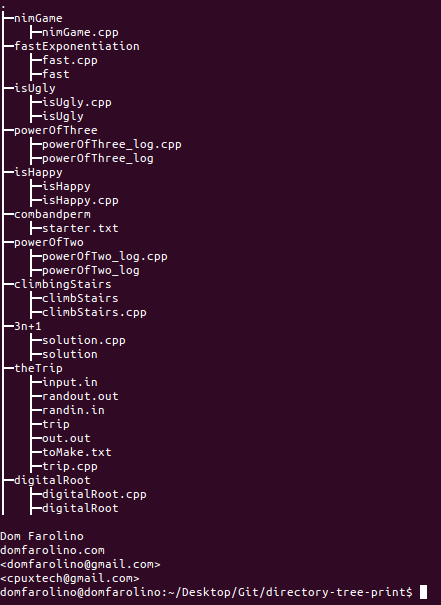

# directory-tree-print
[](http://doge.mit-license.org)

[](https://github.com/domfarolino/directory-tree-print)

Simple C++ program to print out the directory tree structure of a user-specified directory

## Why?
Because I was wanted to include a 'pretty' print out of the directory structure of a few web projects I was working on and didn't want to spend the time doing it by hand.

## How to use
Simply type `./directory-tree-print <directoryNameHere>` to print the tree structure of that directory and all subdirectories.

## Ignores
The directory-tree-print program automatically ignores and does not print the following folders:

 - `.`
 - `..`
 - `.git`
 - `node_modules`
 - `bower_components`

To ignore others, simply type as many file or directory names that you'd like to ignore printing and recursing through after the directory name you are printing and they will automatically be ignored. For example:

```sh
make
./directory-tree-print <directoryNameHere> <ignore.txt> <ignoreFolder> <...etc...>
```
